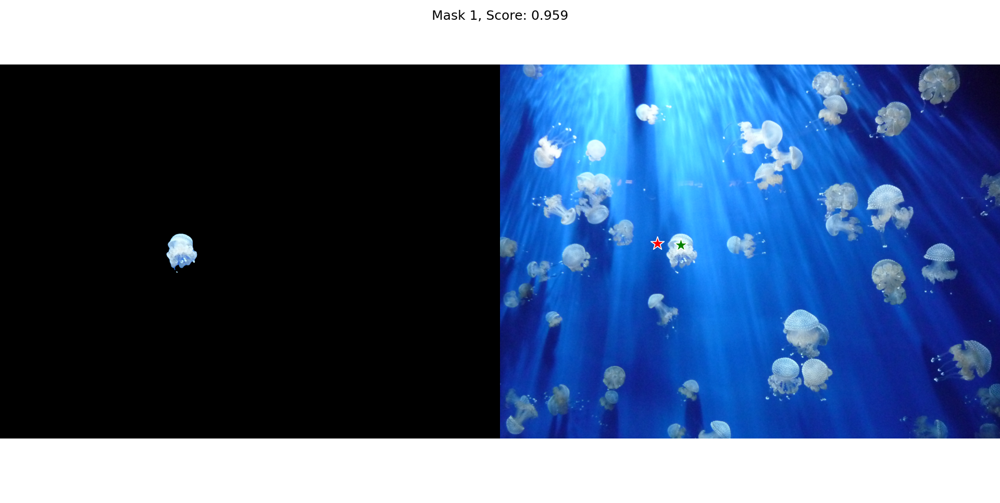

# SAM2ONNX
A set of scripts to export Segment-Anything into ONNX format together with the image encoder

## Overview

The repository represents a small set of scripts to export [SAM model](https://github.com/facebookresearch/segment-anything) into ONNX-format and then run it. Additionally, an example of running the ONNX-exported model with [OpenVINO](https://docs.openvino.ai/2023.0/home.html) in `C++` environment is provided.

As opposed to the example of export to ONNX-format [provided](https://github.com/facebookresearch/segment-anything/blob/main/scripts/export_onnx_model.py) by Meta, the model is exported together with the image encoder although it works as a separate "preprocessing" model.

## Requirements

For exporting the model and running it in python just use the `requirements.txt` file in `pyth` directory. The validity of the scripts has been checked with `Python 3.10.4`.

For running `C++` example the requirements are as follows:

* 17th-standard-capable C++ compiler
* CMake ver. >= 3.21 (probably works with much older versions)
* [CLI11](https://github.com/CLIUtils/CLI11) (installed automatically during CMake project generation) for parsing command line arguments
* OpenCV ver. 4.x for running pre- and post-processing tasks
* OpenVINO ver. >= 2023.0 for inference on ONNX-exported model

OpenVINO is a library for Intel hardware, thus you also need their CPU, GPU or an AI-accelerator to be accessible on your system.

## How to export model and run it in python with `onnxruntime`

First go to the `pyth` folder of the repository and install all the requirements from the `requirements.txt` file.
```
cd ./pyth
python -m pip install -r requirements.txt
```

Now you can run the original SAM-model using `run_original_sam.py` script
```
python run_original_sam.py ../data/test_image.jpg "926, 926, 806, 918" "1, 0"
```

with hopefully seeing the following output on your screen:


As with all the scripts discussed later, the meaning of the used arguments can be found by passing `-h` to the script:
```
python run_original_sam.py -h
```

Now you can try to export the model with
```
python export_model.py ./export
```

The script will create two files in the `./export` folder, `image_encoder.onnx` for the image encoder and `the_rest.onnx` for the rest of the model.

Now check that the ONNX-version of the segment-anything works properly by running
```
python ONNXSam.py ./export ../data/test_image.jpg "926, 926, 806, 918, 0, 0" "1, 0, -1"
```

> Note the trailing zeros for points (the first array of numerical arguments) and "-1" for labels(the second array of numerical arguments). They are required for padding in case you don't provide box inputs (that is the inputs with label values `2` and `3`).

In case everything went well, you will get exactly the same output as from the original SAM model.

## License

SAM model is subject to Apache License. My own code is fully intended for public domain. You can find the details in `SAM_LICENSE` and `LICENSE` files respectively.